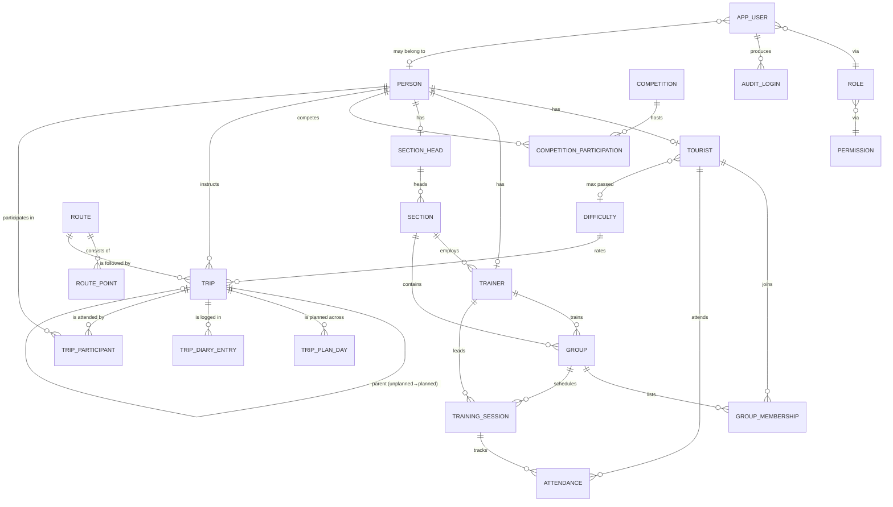

# ER-модель ИС туристического клуба

Финальная схема БД (после ревизии). Любые изменения модели должны сначала
отражаться в этом документе, потом — в ORM и миграциях.

## Ключевые решения и почему

1. **Композиция вместо наследования.** Вместо joined-table inheritance
   (`Tourist`/`Trainer` как наследники `Person`) использованы **профильные таблицы**:
   `person` — общий человек, `tourist`/`trainer`/`section_head` — отдельные
   таблицы 1-к-1 с `person`. Одно физическое лицо может одновременно иметь
   профиль туриста и тренера. SQL-запросы проще (без discriminator-колонки),
   ORM проще (без полиморфизма SQLAlchemy).

2. **`tourist.category`** ∈ {`amateur`, `athlete`, `trainer`} — денормализованная
   подсказка для отчётов и фильтров. Соответствие реальным записям (`trainer`
   существует, если категория `trainer`) проверяется **в сервисном слое**, чтобы
   не плодить хрупкие триггеры.

3. **`trip.instructor_id`** — единственный источник правды об инструкторе похода.
   `trip_participant` хранит всех участников **включая инструктора**, без
   отдельной колонки `role` (избыточно). Триггер проверяет, что
   инструктор есть в `trip_participant`.

4. **`unplanned → planned`.** Реализовано через `trip.parent_trip_id` (само-FK):
   при переводе создаётся новый `trip` с `kind='planned'`, указывающий на
   старый. История сохраняется, нет «мутации сущности».

5. **Категория туриста** = максимальная сложность пройденного **планового**
   завершённого похода. Денормализована в `tourist.max_passed_difficulty_id`,
   обновляется триггером при переходе `trip.status` → `completed`.

6. **`group_membership`** — слабая сущность с суррогатным PK и партиальным
   уникальным индексом `(group_id, tourist_id) WHERE left_at IS NULL`. Это
   позволяет туристу выйти из группы и потом снова вступить.

7. **ACL.** Права (`permission`) — справочник с кодами вида `<entity>.<action>`.
   Роли (`role`) — настраиваемые суперадмином, кроме системной `superadmin`
   (`is_system=true`).

## Диаграмма

## Сущности (краткий справочник)

### Люди

| Таблица | Назначение | Ключевые поля |
|---|---|---|
| `person` | Общие данные о человеке | `id`, `last_name`, `first_name`, `middle_name?`, `sex` (`M`/`F`), `birth_date` |
| `tourist` | Карточка туриста (1-к-1 с person) | `person_id` PK/FK, `category` (`amateur`/`athlete`/`trainer`), `joined_at`, `can_swim`, `sport_rank?`, `specialization?`, `max_passed_difficulty_id?` |
| `trainer` | Рабочая карточка тренера | `person_id` PK/FK, `section_id` FK, `salary`, `hire_date`, `specialization` |
| `section_head` | Рабочая карточка руководителя секции | `person_id` PK/FK, `salary`, `hire_date` |

### Структура клуба

| Таблица | Поля |
|---|---|
| `section` | `id`, `name UNIQUE`, `description`, `head_id` FK→`section_head` |
| `group` | `id`, `section_id` FK, `name`, `trainer_id` FK→`trainer`; `UNIQUE (section_id, name)` |
| `group_membership` | `id`, `group_id` FK, `tourist_id` FK, `joined_at`, `left_at?`; партиальный UNIQUE на активные |

### Тренировки

| Таблица | Поля |
|---|---|
| `training_session` | `id`, `group_id` FK, `trainer_id` FK, `scheduled_at`, `duration_min`, `location`, `activity_type` |
| `attendance` | `training_session_id` FK, `tourist_id` FK, `present`; PK `(training_session_id, tourist_id)` |

### Соревнования

| Таблица | Поля |
|---|---|
| `competition` | `id`, `name`, `held_at`, `location`, `discipline` |
| `competition_participation` | `competition_id` FK, `person_id` FK, `result?`, `place?`; PK композитный |

### Маршруты и походы

| Таблица | Поля |
|---|---|
| `difficulty` | `id`, `code UNIQUE` (`I..VI`), `name`, `min_length_km`, `min_days`, `sort_order` |
| `route` | `id`, `name UNIQUE`, `length_km`, `kind` (`hike`/`horse`/`water`/`mountain`) |
| `route_point` | `id`, `route_id` FK, `order_no`, `name`; `UNIQUE (route_id, order_no)`, `UNIQUE (route_id, name)` |
| `trip` | `id`, `route_id` FK, `instructor_id` FK→`person`, `start_date`, `days_count`, `kind` (`planned`/`unplanned`), `difficulty_id` FK, `parent_trip_id?` FK→self, `status` (`scheduled`/`in_progress`/`completed`/`cancelled`) |
| `trip_plan_day` | `id`, `trip_id` FK, `day_no`, `rest_stops`, `camp_locations`; `UNIQUE (trip_id, day_no)` |
| `trip_diary_entry` | `id`, `trip_id` FK, `day_no`, `content`, `recorded_at` |
| `trip_participant` | `id`, `trip_id` FK, `person_id` FK; `UNIQUE (trip_id, person_id)` |

### Безопасность (ACL)

| Таблица | Поля |
|---|---|
| `app_user` | `id`, `login UNIQUE`, `password_hash`, `is_active`, `person_id?` FK→`person`, `created_at`, `last_successful_login_at?` |
| `role` | `id`, `name UNIQUE`, `description`, `is_system` |
| `permission` | `id`, `code UNIQUE` (e.g. `tourist.read`), `description` |
| `role_permission` | `role_id`, `permission_id`; PK композитный |
| `user_role` | `user_id`, `role_id`; PK композитный |
| `audit_login` | `id`, `user_id?` FK, `login_attempted`, `event_at`, `success`, `ip_address?`, `user_agent?` |

## Триггеры (миграция `0002`)

1. **`trg_trip_instructor_qualified`** (`BEFORE INSERT OR UPDATE ON trip`) —
   при появлении/смене инструктора убеждается, что он раньше участвовал
   в завершённом походе сложности ≥ текущей. Для самой низкой сложности
   (минимальный `sort_order`) проверка пропускается — иначе bootstrap невозможен.
2. **`trg_trip_instructor_is_participant`** (`AFTER INSERT OR UPDATE ON trip`,
   `AFTER INSERT ON trip_participant`) — гарантирует, что `trip.instructor_id`
   присутствует среди `trip_participant.person_id` соответствующего похода.
3. **`trg_water_trip_requires_swim`** (`BEFORE INSERT ON trip_participant`) —
   если поход идёт по маршруту `kind='water'`, у туриста (если у человека
   есть профиль туриста) должен быть `can_swim=true`.
4. **`trg_trip_completed_updates_tourist_category`** (`AFTER UPDATE ON trip`) —
   когда `trip.status` переходит в `completed` и `kind='planned'`: для всех
   участников-туристов поднять `max_passed_difficulty_id`, если новый
   `difficulty.sort_order` выше текущего.

`CHECK`-ограничения зашиты в `__table_args__` моделей и переносятся в
миграцию 0001.

## Чек-лист: схема покрывает все 13 запросов варианта

| # | Запрос | Откуда берётся |
|---|---|---|
| 1 | Туристы в секции / группе / по полу / году / возрасту | `tourist` ⋈ `group_membership` ⋈ `group` ⋈ `section` ⋈ `person` |
| 2 | Тренеры по секции / полу / возрасту / зарплате / специализации | `trainer` ⋈ `person` ⋈ `section` |
| 3 | Соревнования спортсменов секции | `competition_participation` ⋈ `tourist` (по `person_id`) ⋈ `group_membership` ⋈ `group` ⋈ `section` |
| 4 | Тренеры тренировок в группе за период | `training_session` ⋈ `trainer` (фильтр по `group_id`, `scheduled_at`) |
| 5 | Туристы по походам (по количеству / точке / категории) | `trip_participant` ⋈ `trip` ⋈ `route_point` |
| 6 | Руководители секций по зп / году / возрасту / стажу | `section_head` ⋈ `person` |
| 7 | Нагрузка тренеров (часы по типам занятий за период) | агрегат по `training_session.duration_min` |
| 8 | Маршруты по секции / периоду / инструктору / количеству групп | `route` ⋈ `trip` ⋈ `trip_participant` ⋈ `group_membership` ⋈ `section` |
| 9 | Маршруты через точку / по длине / по сложности | `route` ⋈ `route_point` ⋈ `trip` ⋈ `difficulty` |
| 10 | Туристы, способные ходить в указанные типы походов | `tourist.can_swim` + правила (water требует swim) |
| 11 | Инструкторы по категории / походам / маршруту / точке | `trip.instructor_id` агрегаты, `route_point` |
| 12 | Туристы, ходившие в поход со своим тренером в роли инструктора | `trip_participant` ⋈ `trip.instructor_id` = `group.trainer_id` (через `group_membership`) |
| 13 | Туристы, ходившие по всем / по указанным маршрутам | `division`-запрос: `trip_participant` GROUP BY person HAVING COUNT DISTINCT route = ... |

Все 13 запросов выразимы без хитрых обходов.
